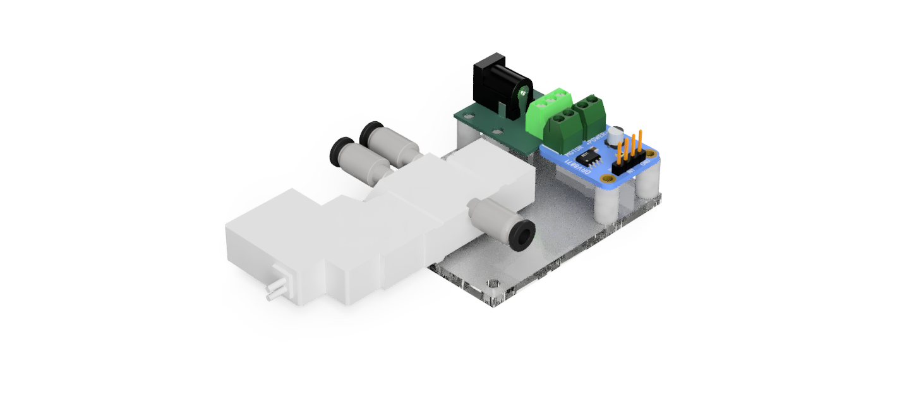
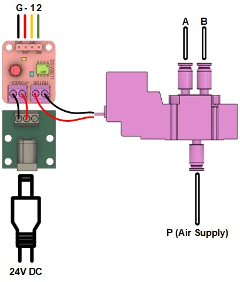

# Pico Pneumatic Valve

This repository provides MicroPython firmware for controlling a 5/2 pneumatic solenoid valve using the RP2040 microcontroller. The solenoid is driven via a DRV8871 brushed DC motor driver breakout, capable of handling inductive loads and providing thermal and overcurrent protection. Power is supplied through the ET-CONV DC JACK V2, supporting a stable DC input. The system enables digital control of pneumatic actuation for soft robotics, automation, or experimental setups. The code includes GPIO control logic, timing sequences, and basic fault tolerance for reliable operation under embedded constraints.

# Wiring diagram

# Example

The code for this example can be found [here](example/example.py).

# Hardware details
* [CAD](hardware/pico_pneumatic_valve.step)
* [DRV8871_breakout](https://cdn-learn.adafruit.com/downloads/pdf/adafruit-drv8871-brushed-dc-motor-driver-breakout.pdf)
* [DRV8871 datasheet](https://www.ti.com/lit/ds/symlink/drv8871.pdf?ts=1747286551105&ref_url=https%253A%252F%252Fwww.google.com%252F)
* [DC Jack](https://www.ett.co.th/prod2013/et-conv/et-conv%20dc%20jack%20v2.html)
